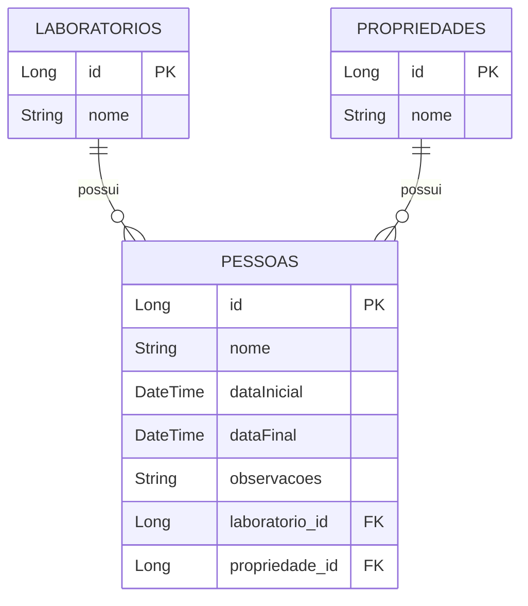

# Teste para Desenvolvedor Backend Java na empresa Agrotis

## Execução do projeto

- Para executar o projeto, basta acessar o arquivo TesteAgrotisApplication.java e executá-lo (o projeto está configurado para a porta 8080).
- Para executar os testes de dentro do próprio projeto, basta rodar o mvn:test.
- Para executar os testes do postman, é recomendado rodar o projeto do zero e executar a run do postman logo em seguida, antes de alterar algo.
- Para facilitar a execução em qualquer máquina, optei pelo banco de dados H2.

Link para a collection do postman: https://drive.google.com/drive/folders/1AbQdDAMrq78yOoyilg3ofD3SDs0US38U?usp=sharing

## Descrição do projeto

Para iniciar, utilizei a seguinte estrutura de modelagem no projeto:



## O desafio e a solução

Nesta seção, descreverei como os pontos do desafio foram solucionados um por um.

Para a aplicação dos filtros, foram utilizados query builders a partir das Specifications.

- ```A API deve realizar as validações necessárias para garantir a integridade dos dados e expor os serviços necessários para a listagem, busca, inserção, atualização e deleção dos dados (CRUD);```
  - Para a solução desse problema, foi definida uma estrutura como mostrada no diagrama ER acima dessa seção, além da criação de entidades, repositórios, services e controllers no código para fazer o CRUD padrão.
  - Na última seção, todos os endpoints são listados. Dentre eles, todos os necessários para os CRUDs da aplicação.
- ```Verificar a necessidade de serviços adicionais para popular os ListViews (Propriedade e Laboratório);```
  - Aqui existem 2 endpoints chave para trazer essa listagem: GET para /laboratorios e GET para /propriedades, que vai retornar os laboratórios e propriedades trazendo os nomes e os IDs que são necessários para o cadastro das pessoas.
- ```Adicionalmente, gerar um endpoint que retorne uma lista de laboratórios com as seguintes características: ```
  - Essa fase me gerou um pouco de dúvidas sobre os filtros. Fiquei sem entender se era para fazer somente o endpoint para retornar laboratórios ou se também era para fazer um para clientes. Na dúvida, fiz um endpoint para laboratórios com todos os filtros indicados e um endpoint para pessoas com os filtros que lhe cabiam.
  - O endpoint é GET /laboratorios/with-filters e os parâmetros devem ser passados por meio do path. Exemplo: http://localhost:8080/laboratorios/with-filters?quantidadeMinima=2&observacoes=rente&ordenarPorEntradaMaisAntiga=true
  - O retorno vai ser sempre uma lista de laboratórios (podendo estar vazia) com a estrutura do exemplo: {
        "id": 3,
        "nome": "LABORATÓRIO MODELO 3",
        "quantidadePessoas": 3
    }
  - O endpoint para retornar laboratórios funciona da seguinte forma:
    - O campo quantidadeMinima é obrigatório e deve ser maior ou igual a 0 (sem isso, uma exceção é lançada);
    - Os campos relacionados à data inicial não podem ter a data máxima menor que a data mínima (caso contrário, retorna uma exceção), o mesmo ocorre para data final;
    - Quando os campos para intervalo de data são preenchidos, seram retornados somente os laboratórios que contenham pelo menos um cliente que cumpra a restrição do filtro;
    - O campo observação é totalmente opcional e vai retornar os laboratórios que tenham pelo menos um cliente com aquele trecho de descrição (uso do operador %LIKE%);
    - Os laboratórios sempre são ordenados pela quantidade de clientes;
    - Caso o campo ordenarPorEntradaMaisAntiga seja marcado como true, secundariamente eles são ordenados por quem tem o cliente mais antigo;
    - Para a ordenação, no caso dos laboratórios, isso foi feito por meio das próprias lista com o método sorted().
- Como solução adicional ao problema anterior, também foi criado um filtro para pessoas:
  - O filtro pode ser aplicado no próprio endpoint GET /pessoas e aceita todos os filtros de intervalo de datas e o de observação. Todos os filtros são opcionais.
- Para a persistência de pessoas, é validado se todos os campos obrigatórios foram preenchidos (caso contrário, uma exception será lançada).
  - Aqui vai um exemplo usado nos testes para fazer a requisição (caso a data final seja posterior à inicial, uma exception será lançada):
  ```json
    {
    "nome": "Jon doe",
    "dataInicial": "2022-02-01T17:41:43Z",
    "dataFinal": "2022-02-02T17:41:44Z",
    "infosPropriedade": {
        "id": 1,
        "nome": "Fazenda Modelo 1"
    },
    "laboratorio": {
        "id": 1,
        "nome": "Laboratório Modelo 1"
    }

## Cobertura de Testes

O projeto possui testes unitários e de integração abrangentes para cada camada da aplicação:

#### Testes de Controladores (Integration Tests)
- Testes de todos os endpoints REST
- Validação de respostas HTTP
- Verificação de formato JSON
- Testes de casos de sucesso e erro
- Cobertura de paginação e filtros

#### Testes de Serviços (Unit Tests)
Cobertura completa das operações CRUD para:
- `PropriedadeService`
- `LaboratorioService`
- `PessoaService`

Principais cenários testados:
- Busca por ID (sucesso e não encontrado)
- Listagem completa
- Paginação
- Persistência (dados válidos e inválidos)
- Deleção (sucesso e não encontrado)
- Validações de negócio

#### Configurações de Teste
- Uso de banco H2 em memória
- Profile específico para testes (`test`)
- Transações isoladas com `@Transactional`
- Mocks com Mockito
- Assertions com JUnit 5

#### Cobertura
- Controllers: ~100%
- Services: ~100%
- Repositories: ~100%
- Models: ~100%

Tecnologias utilizadas nos testes:
- JUnit 5
- Mockito
- MockMvc
- H2 Database
- Spring Test

## Demais Endpoints e Parâmetros

Para acesso aos dados e à persistência dentro do projeto, foram criados os seguintes endpoints:

#### Endpoints de Propriedades:
 - GET /propriedades
    - Descrição: Retorna todas as propriedades cadastradas
    - Parâmetros: Nenhum
    - Retorno: Lista de propriedades com seus respectivos IDs e nomes
 - GET /propriedades/pageable
    - Descrição: Retorna propriedades de forma paginada
    - Parâmetros:
      - page: Número da página (opcional)
      - size: Quantidade de itens por página (opcional)
      - sort: Campo e direção de ordenação (opcional)
    - Retorno: Página contendo propriedades com seus respectivos IDs e nomes
 - GET /propriedades/{id}
    - Descrição: Busca uma propriedade específica pelo ID
    - Parâmetros:
      - id: ID da propriedade (path variable)
    - Retorno: Dados da propriedade solicitada
 - POST /propriedades
    - Descrição: Cria uma nova propriedade
    - Parâmetros:
      - Body: Objeto com os dados da propriedade
      ```json
      {
          "nome": "Nome da Propriedade"
      }
      ```
    - Retorno: Dados da propriedade criada
 - PUT /propriedades/{id}
    - Descrição: Atualiza uma propriedade existente
    - Parâmetros:
      - id: ID da propriedade (path variable)
      - Body: Objeto com os dados atualizados
      ```json
      {
          "nome": "Novo Nome da Propriedade"
      }
      ```
    - Retorno: Dados da propriedade atualizada
 - DELETE /propriedades/{id}
    - Descrição: Remove uma propriedade
    - Parâmetros:
      - id: ID da propriedade (path variable)
    - Retorno: 204 No Content
  
### Endpoints de Pessoas:
- GET /pessoas
  - Descrição: Lista todas as pessoas
  - Parâmetros:
    - pessoaSpecification: Filtros de busca (query params)
  - Retorno: Lista de pessoas com seus dados, incluindo propriedade e laboratório associados
- GET /pessoas/pageable
  - Descrição: Retorna pessoas de forma paginada
  - Parâmetros:
    - page: Número da página (opcional)
    - size: Quantidade por página (opcional)
    - sort: Campo e direção de ordenação (opcional)
  - Retorno: Página contendo pessoas com seus dados completos
- GET /pessoas/{id}
  - Descrição: Busca uma pessoa específica
  - Parâmetros:
    - id: ID da pessoa (path variable)
  - Retorno: Dados completos da pessoa solicitada
- POST /pessoas
  - Descrição: Cria uma nova pessoa
  - Parâmetros:
    - Body: Objeto com os dados da pessoa
    ```json
    {
        "nome": "Nome da Pessoa",
        "dataInicial": "2024-01-10T08:00:00",
        "dataFinal": "2024-01-20T17:00:00",
        "observacoes": "Observações",
        "propriedadeId": 1,
        "laboratorioId": 1
    }
    ```
  - Retorno: Dados da pessoa criada
- PUT /pessoas/{id}
  - Descrição: Atualiza uma pessoa
  - Parâmetros:
    - id: ID da pessoa (path variable)
    - Body: Dados atualizados (mesmo formato do POST)
  - Retorno: Dados da pessoa atualizada
- DELETE /pessoas/{id}
  - Descrição: Remove uma pessoa
  - Parâmetros:
    - id: ID da pessoa (path variable)
  - Retorno: 204 No Content

### Endpoints de Laboratórios:
- GET /laboratorios
  - Descrição: Retorna todos os laboratórios
  - Parâmetros: Nenhum
  - Retorno: Lista de laboratórios com seus IDs e nomes
- GET /laboratorios/pageable
  - Descrição: Retorna laboratórios paginados
  - Parâmetros:
    - page: Número da página (opcional)
    - size: Quantidade por página (opcional)
    - sort: Campo e direção de ordenação (opcional)
  - Retorno: Página contendo laboratórios
- GET /laboratorios/{id}
  - Descrição: Busca um laboratório específico
  - Parâmetros:
    - id: ID do laboratório (path variable)
  - Retorno: Dados do laboratório solicitado
- GET /laboratorios/with-filters
  - Descrição: Busca laboratórios filtrados
  - Parâmetros:
    - filters: Especificações de filtro
    - ordenarPorEntradaMaisAntiga: Ordenação por data
  - Retorno: Lista formatada de laboratórios
- POST /laboratorios
  - Descrição: Cria um novo laboratório
  - Parâmetros:
    - Body: Objeto com dados
    ```json
    {
        "nome": "Nome do Laboratório"
    }
    ```
  - Retorno: Laboratório criado
- PUT /laboratorios/{id}
  - Descrição: Atualiza um laboratório
  - Parâmetros:
    - id: ID do laboratório
    - Body: Dados atualizados (mesmo formato do POST)
  - Retorno: Laboratório atualizado
- DELETE /laboratorios/{id}
  - Descrição: Remove um laboratório
  - Parâmetros:
    - id: ID do laboratório
  - Retorno: 204 No Content
